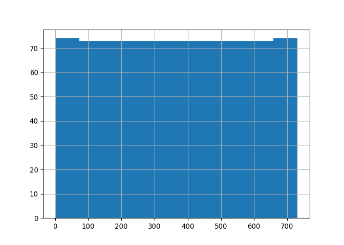

# Wirtschaftlichkeit Saisonaler Erdwärmespeicher


## Setup

``` r
# RStudio 23.12.0 on Linux Mint Debian Edition 6
# install python version = '3' #3.12
# install.packages('reticulate')
library(reticulate)
# reticulate::repl_python() #say yes
# py_install("pandas", envname = 'r-reticulate')
# py_install("openpyxl", envname = 'r-reticulate')
# py_install(c('matplotlib', 'seaborn'), envname = 'r-reticulate')

# insert chunk shortcut: Ctrl+Alt+P
# from:
# https://stackoverflow.com/questions/62408197/editing-keyboard-shortcut-to-produce-code-chunk-in-r-studio
```

## Readme

Choice of language: As this work is based on heliogaia.de which is
written in German and as I hope, that a pilot project for “Saisonale
Erwärmespeicher” will be started in Germany and thus has to use quite a
lot of German data sources and variable names, I am using mostly the
German language here.

Sprachwahl: Da diese Arbeit auf heliogaia.de basiert und da ich hoffe,
dass ein Pilotprojekt für Saisonale Wärmespeicher in Deutschland
realisert wird, also viele deutsche Variablennamen verwenden wird, die
auch zur Zeit noch im Entstehen sein sollten, verwende ich hier zunächst
der Schnelligkeit halber die deutsche Sprache.

Falls hier R chunks verwendet werden, beginnen sie zwecks Sichtbarkeit
auf Github mit dem Kommentar \#r (ausser sie sind reine
Variablenzuweisungen mit \<-) - sonstige chunks sind in Python
geschrieben.

Geldbetraege sind in Euro, sofern nicht anders vermerkt.

## Packages

``` python
# from IPython.display import Markdown as md
```

## Start

``` r
# browseURL('https://heliogaia.de/endergebnisse.html')
# browseURL('https://heliogaia.de/tabellen.html')
# browseURL('/home/danielwittig/repos/Saisonale_Erdwaermespeicher/_base')
```

### Rechenweg

Vorerst nur:

Zielszenario, ohne Blockheizkraftwerk (BHKW), Menschen leben in
sanierten Gebäuden mit durchschnittlich 80 kWh/a/m²

Erweiterungsmöglichkeit:

Übergangsszenario, mit BHKW, nicht alle Einwohner leben in sanierten
Gebäuden, drei Fernwärmeleitungen nötig

#### Szenarien:

https://heliogaia.de/tabellen.html : in der Regel :

- Blatt “e” simuliert eine zweijährige Wärmebilanz pro Person in
  Tagesschritten, einschließlich des Ladeverhaltens des Saisonspeichers.
  Die Parameter werden rechts in blaue Felder eingegeben.
- Blatt “t” berechnet daraus und aus weiteren Parametern das
  Gesamtergebnis.
- Blätter “h”, “u” und “s” dienen zur Abschätzung von Hauptverteilung
  und Unterverteilung im Fernwärmenetz sowie zum Erfassen der
  Siedlungsparameter.

Zur Aufdeckung und Vermeidung systematischer Fehler und teils auch zur
Aufwandsbegrenzung ist die Herangehensweise nicht in allen Tabellen
analog. *ToDo: was differiert?*

##### Roebel

``` python
Quelldatei = 'jahreslauf_roebel.xlsx'
```

``` python
# D200
# D207
# D198
# D203
# D204
```

``` python
#€/a/Kopf       brutto
Investition_fuer_die_gesamte_Anlage_mit_Nebenkosten = 640 # D200

#€/a/Kopf
laufende_Kosten_pro_a_pro_Kopf = 319 # D207

#€/a/Kopf
Investitionskosten_pro_a_pro_Kopf_BHKW__ohne_Energiekosten_ = 23.9 # D198

#€/a/Kopf
laufende_Kosten_pro_a_pro_Kopf_Energiekosten_BHKW = 340 # D203

#€/a/Kopf
laufende_Kosten_pro_a_pro_Kopf_Ertrag_BHKW__Elektroenergie = -133 # D204
```

``` r
library(reticulate)
#r 
# Formatierungstest: werden lange Variablennamen in r oder python im github markdown umgebrochen?
jaehrliche_Gesamtkosten_pro_Kopf___fuer_Heizung_und_Warmwasser_in_allen_privat__oeffentlich_und_gewerblich_genutzten_Gebaeuden__ohne_Kapitalkosten_ <- 
  py$Investition_fuer_die_gesamte_Anlage_mit_Nebenkosten +
  py$laufende_Kosten_pro_a_pro_Kopf -
  py$Investitionskosten_pro_a_pro_Kopf_BHKW__ohne_Energiekosten_ -
  py$laufende_Kosten_pro_a_pro_Kopf_Energiekosten_BHKW -
  py$laufende_Kosten_pro_a_pro_Kopf_Ertrag_BHKW__Elektroenergie

# jaehrliche_Gesamtkosten_pro_Kopf___fuer_Heizung_und_Warmwasser_in_allen_privat__oeffentlich_und_gewerblich_genutzten_Gebaeuden__ohne_Kapitalkosten_ =728


jaehrliche_Gesamtkosten_pro_Kopf___fuer_Heizung_und_Warmwasser_in_allen_privat__oeffentlich_und_gewerblich_genutzten_Gebaeuden__ohne_Kapitalkosten_
```

    [1] 728.1

Summe

``` python
#Quellzelle: Blatt t: D210
#€/a/Kopf
jaehrliche_Gesamtkosten_pro_Kopf___fuer_Heizung_und_Warmwasser_in_allen_privat__oeffentlich_und_gewerblich_genutzten_Gebaeuden__ohne_Kapitalkosten_ =\
Investition_fuer_die_gesamte_Anlage_mit_Nebenkosten\
+laufende_Kosten_pro_a_pro_Kopf\
-Investitionskosten_pro_a_pro_Kopf_BHKW__ohne_Energiekosten_\
-laufende_Kosten_pro_a_pro_Kopf_Energiekosten_BHKW\
-laufende_Kosten_pro_a_pro_Kopf_Ertrag_BHKW__Elektroenergie

# jaehrliche_Gesamtkosten_pro_Kopf___fuer_Heizung_und_Warmwasser_in_allen_privat__oeffentlich_und_gewerblich_genutzten_Gebaeuden__ohne_Kapitalkosten_ =728


jaehrliche_Gesamtkosten_pro_Kopf___fuer_Heizung_und_Warmwasser_in_allen_privat__oeffentlich_und_gewerblich_genutzten_Gebaeuden__ohne_Kapitalkosten_
```

    728.1

``` python

#mögliche Nebenrechnung:
# bei eingepreistem Fremdenergieeinsatz von nur noch    2.16%
```

Umrechnung auf monatlich

``` python
#Quelldatei: endrechnung.xlsx
#€/Monat/Kopf
monatliche_Gesamtkosten_pro_Kopf___fuer_Heizung_und_Warmwasser_in_allen_privat__oeffentlich_und_gewerblich_genutzten_Gebaeuden__ohne_Kapitalkosten_ = jaehrliche_Gesamtkosten_pro_Kopf___fuer_Heizung_und_Warmwasser_in_allen_privat__oeffentlich_und_gewerblich_genutzten_Gebaeuden__ohne_Kapitalkosten_ / 12

monatliche_Gesamtkosten_pro_Kopf___fuer_Heizung_und_Warmwasser_in_allen_privat__oeffentlich_und_gewerblich_genutzten_Gebaeuden__ohne_Kapitalkosten_
```

    60.675000000000004

## Endergebnis

``` r
min_Anschliesser_count <- 5000

#km
max_Einzugsradius_km <- 6

#€/Monat/Kopf
neue_Gebaeudeenergiekosten_pPpM_ohne_Kapitalkosten_und_Foerdermittel <- py$monatliche_Gesamtkosten_pro_Kopf___fuer_Heizung_und_Warmwasser_in_allen_privat__oeffentlich_und_gewerblich_genutzten_Gebaeuden__ohne_Kapitalkosten_ #nur Roebel

#m
max_Bohrtiefe <- 'ToDo' # ToDo

#m/s
min_Wasserdurchlaessigkeit <- 'ToDo' #ToDo

#€/Monat/Kopf
bisherige_Gebaeudeenergiekosten_pPpM <- 65
```

Eine Kommunale Solarheizung mit saisonalem Erwärmespeicher, Solarthermie
und Wärmenetz lohnt sich überall dort, wo mindestens 5000 Anschließer
auf einem Radius von weniger als 6 Kilomentern teilnehmen und der Boden
bis in ToDo m Tiefe mindestens einen Wasserdurchlässigkeitswert von ToDo
m/s hat. ([Quelle](https://heliogaia.de/endergebnisse.html))

Hintergrund:

Wegen ihrer annähernd gleichen Wichtung *ToDo: welche Wichtung?* liefert
die Mittlung der gefundenen Zahlen Anhaltspunkte für den Bedarf bei
einem bundesweiten Ausbau der Heliogaia-Netze zur Finanzierung einen
laufenden Betrag von 60.675 € pro Person und Monat ohne Berücksichtigung
von Kapitalkosten und Fördermitteln.

Bisher wurden in Deutschland jährlich 65 Milliarden Euro für
Gebäudeenergie ausgegeben
[Dena](https://heliogaia.de/9254_Gebaeudereport_dena_kompakt_2018.pdf),
S.7, das sind monatlich ca. 65€ pro Kopf.

## Tests

#### basics

``` python
min_Anschliesser_count = 5000
max_Einzugsradius_km = 6
```

Eine Kommunale Solarheizung mit saisonalem Erwärmespeicher, Solarthermie
und Wärmenetz lohnt sich überall dort, wo mindestens 5000 Anschließer
auf einem Radius von weniger als 6 Kilomentern teilnehmen.
([Quelle](https://heliogaia.de/endergebnisse.html))

``` python
#py
import pandas as pd
#version from 2024-01-11
df = pd.read_excel(
  '/home/danielwittig/repos/Saisonale_Erdwaermespeicher/_base/jahreslauf_roebel.xlsx'
  , sheet_name='e', header = 1)
print(df.shape)
```

    (737, 28)

``` python
mypyvar0 = df.shape[0]
mypyvar1 = df.shape[1]
df.head(7)
```

       Tag                Datum  ... Unnamed: 26 Unnamed: 27
    0  NaN                  NaN  ...         NaN         NaN
    1    0  2019-03-21 00:00:00  ...         NaN         NaN
    2    1  2019-03-22 00:00:00  ...         NaN         NaN
    3    2  2019-03-23 00:00:00  ...         NaN         NaN
    4    3  2019-03-24 00:00:00  ...         NaN         NaN
    5    4  2019-03-25 00:00:00  ...         NaN         NaN
    6    5  2019-03-26 00:00:00  ...         NaN         NaN

    [7 rows x 28 columns]

``` python
df.loc[:732,'Tag'].hist()
```



``` r
#r
myrvar= 1
```

- now let’s include a python variable here: 737 - wow, so inline!
- now let’s include an r variable here: 1 - wow, so inline again!

When you click the **Render** button a document will be generated that
includes both content and the output of embedded code. You can embed
code like this:

#### if needed

``` python
# from IPython.display import Markdown as md
# 
# fr=2 #GHz
# 
# md("Good Morning! This yields $f_r = %i$ GHz and $Z_p = %f$ mm."%(fr, 3.45))
```

You can add options to executable code like this

    [1] 4

The `echo: false` option disables the printing of code (only output is
displayed).

## ToDos

### Prio 1

qqq backup - get formulae overview 2024-01-12 \### Prio 2 -
Berücksichtigung von Kapitalkosten und Fördermitteln

### nice to have

- put bash chunks for setup at the beginning

- Wegen ihrer annähernd gleichen Wichtung liefert die Mittlung der
  gefundenen Zahlen Anhaltspunkte für den Bedarf bei einem bundesweiten
  Ausbau der Heliogaia-Netze:

  0,03% des Territoriums für Speicher, maximal 1,5% für Kollektorfelder
  \*) Der Anteil der Verkehrsflächen beträgt zwischen 3 und 5%, je
  nachdem, was alles mitgezählt wird.

- ## Thanks to

https://nrennie.rbind.io/blog/combining-r-and-python-with-reticulate-and-quarto/
https://stackoverflow.com/questions/62408197/editing-keyboard-shortcut-to-produce-code-chunk-in-r-studio
