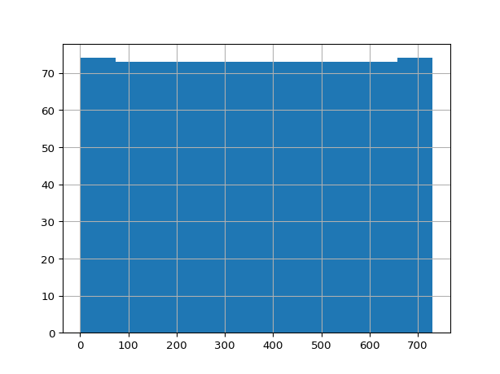

# Wirtschaftlichkeit Saisonaler Erdwärmespeicher


## Setup

``` r
# RStudio 23.12.0 on Linux Mint Debian Edition 6
# install python version = '3' #3.12
# install.packages('reticulate')
library(reticulate)
# reticulate::repl_python() #say yes
# py_install("pandas", envname = 'r-reticulate')
# py_install("openpyxl", envname = 'r-reticulate')
# py_install(c('matplotlib', 'seaborn'), envname = 'r-reticulate')
```

## Language

Choice of language: As this work is based on heliogaia.de which is
written in German and as I hope, that a pilot project for “Saisonale
Erwärmespeicher” will be started in Germany and thus has to use quite a
lot of German data sources and variable names, I am using mostly the
German language here.

Sprachwahl: Da diese Arbeit auf heliogaia.de basiert und da ich hoffe,
dass ein Pilotprojekt für Saisonale Wärmespeicher in Deutschland
realisert wird, also viele deutsche Variablennamen verwenden wird, die
auch zur Zeit noch im Entstehen sein sollten, verwende ich hier zunächst
der Schnelligkeit halber die deutsche Sprache.

## Start

``` python
import pandas as pd
#version from 2024-01-11
df = pd.read_excel('/home/danielwittig/repos/Saisonale_Erdwaermespeicher/_base/jahreslauf_roebel.xlsx', sheet_name='e', header = 1)
print(df.shape)
```

    (737, 28)

``` python
mypyvar0 = df.shape[0]
mypyvar1 = df.shape[1]
df.head(7)
```

       Tag                Datum  ... Unnamed: 26 Unnamed: 27
    0  NaN                  NaN  ...         NaN         NaN
    1    0  2019-03-21 00:00:00  ...         NaN         NaN
    2    1  2019-03-22 00:00:00  ...         NaN         NaN
    3    2  2019-03-23 00:00:00  ...         NaN         NaN
    4    3  2019-03-24 00:00:00  ...         NaN         NaN
    5    4  2019-03-25 00:00:00  ...         NaN         NaN
    6    5  2019-03-26 00:00:00  ...         NaN         NaN

    [7 rows x 28 columns]

``` python
df.loc[:732,'Tag'].hist()
```



``` r
myrvar= 1
```

## Running Code

- now let’s include a python variable here: 737 - wow, so inline!
- now let’s include an r variable here: 1 - wow, so inline again!

When you click the **Render** button a document will be generated that
includes both content and the output of embedded code. You can embed
code like this:

``` r
1 + 1
```

    [1] 2

You can add options to executable code like this

    [1] 4

The `echo: false` option disables the printing of code (only output is
displayed).
